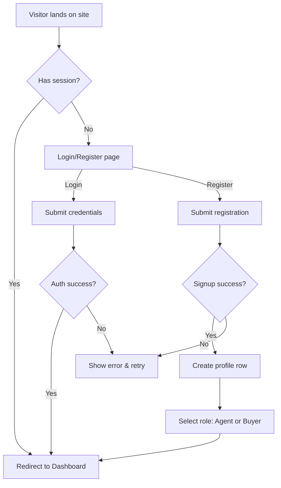
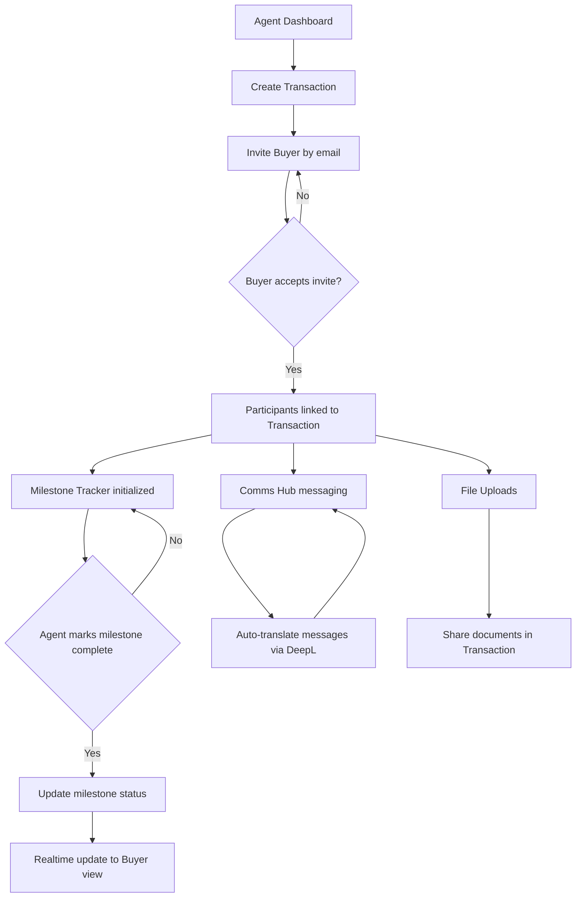

# User Flows (Mermaid)

This document describes key user flows for authentication and transaction lifecycle using Mermaid diagrams.

## Authentication Flow

## Transaction Flow

### Notes
- Session handling is managed by Supabase Auth (planned).
- Participants define access scope for milestones, messages, and files.
- Realtime updates use Supabase channels/subscriptions (planned).

