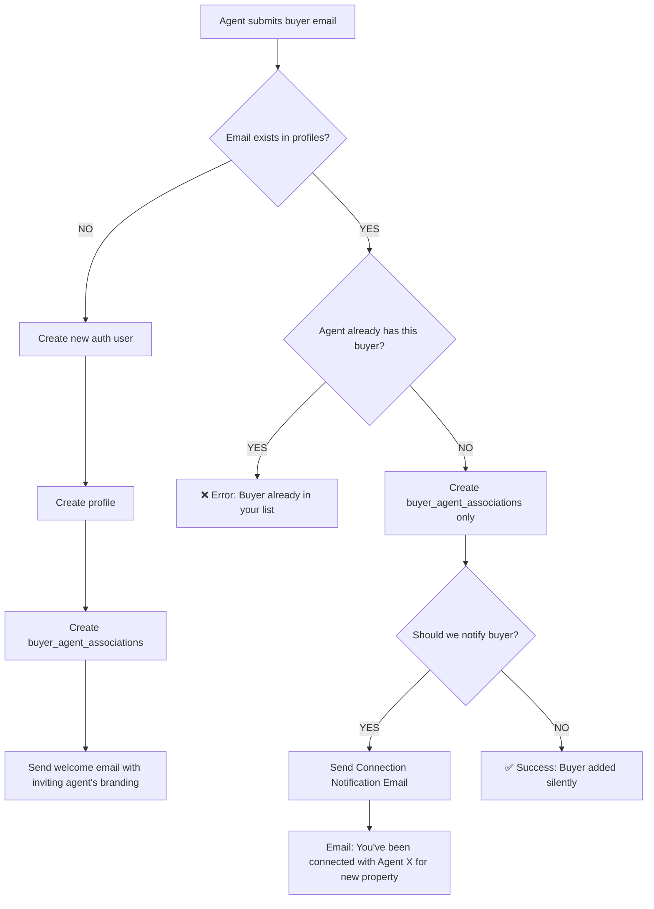

# Multi-Agent Buyer Management Strategy

## 🎯 **Problem Statement**

A buyer may work with multiple agents on different property projects simultaneously. The current system:

1. ❌ **Fails** when Agent B tries to add a buyer already registered by Agent A
2. ❌ **No mechanism** for buyers to see all their transactions across multiple agents
3. ❌ **Branding confusion** - which agent's branding should apply when a buyer works with multiple agents?
4. ❌ **Email confusion** - which agent's branding goes in transaction emails?

---

## 🧠 **Core Challenge: Context-Aware Branding**

### **The Branding Problem**

**Current Implementation (BrandingContext.tsx, lines 40-116):**
- Buyers get branding from their **most recent transaction** (line 55: `order by invited_at desc, limit 1`)
- This means branding changes based on timing, not context
- **Problem:** When Buyer opens Transaction A (Agent 1), they see Agent 2's branding if Transaction B (Agent 2) was created later

**Example Scenario:**
```
Timeline:
Jan 1:  Agent 1 creates Transaction A (Villa in Rome) → Buyer sees Agent 1's branding ✓
Jan 15: Agent 2 creates Transaction B (Apartment in Milan) → Buyer now sees Agent 2's branding everywhere ✗
        When Buyer views Transaction A, they see Agent 2's branding ✗✗
```

---

## ✅ **Proposed Solution: Transaction-Scoped Branding**

### **Core Principle**
> **Branding should follow the TRANSACTION, not the USER's most recent activity**

### **Implementation Strategy**

#### **1. Buyer Dashboard (All Transactions View)**
**Context:** Buyer viewing `/dashboard` with transactions from multiple agents

**Solution:** **Neutral Platform Branding**
```typescript
// On /dashboard - show platform branding (no agent branding)
- Header: "The Property Gateway" (no agent logo)
- Colors: Default platform theme
- Layout: Card-based with agent attribution on each transaction card

Transaction Card Example:
┌─────────────────────────────────────┐
│ 🏠 Villa in Lake Como              │
│ 📍 Bellagio, Italy                  │
│ 👤 Agent: Maria Rossi Real Estate   │  ← Show agent name/logo on card
│ 🔵 Status: Active | Progress: 45%  │
│ 📅 Last Updated: 2 days ago         │
└─────────────────────────────────────┘
```

#### **2. Transaction Detail Page (Single Transaction View)**
**Context:** Buyer viewing `/transaction/[id]`

**Solution:** **Agent-Specific Branding Based on Transaction Creator**
```typescript
// Fetch transaction.created_by and apply THAT agent's branding
const { data: transaction } = await supabase
  .from('transactions')
  .select(`
    *,
    agent:profiles!transactions_created_by_fkey (
      id,
      full_name,
      branding_logo_url,
      branding_settings
    )
  `)
  .eq('id', transactionId)
  .single();

// Apply agent branding ONLY for this transaction page
applyBranding(transaction.agent.branding_logo_url, transaction.agent.branding_settings);
```

**Result:**
- Transaction A (Agent 1) → Shows Agent 1's logo/colors
- Transaction B (Agent 2) → Shows Agent 2's logo/colors
- Dashboard → Shows platform branding

---

## 📧 **Email Branding Strategy**

### **Rule: Email Branding = Transaction's Agent**

**All transaction-related emails should use the agent who created that transaction:**

| Email Type | Branding Source | Example |
|------------|----------------|---------|
| Milestone Update | Transaction's agent | "🏠 Progress Update: Villa in Rome" with Agent 1's branding |
| New Message | Transaction's agent | "💬 New message in Transaction A" with Agent 1's branding |
| Document Upload | Transaction's agent | "📄 New document in Transaction B" with Agent 2's branding |
| Welcome Email (Buyer Creation) | Creating agent | "Welcome to The Property Gateway" with inviting agent's branding |

**Implementation:**
```typescript
// In email-templates.ts - pass agent branding as parameter
export function generateTransactionEmail(data: {
  transactionId: string;
  agentBranding: {
    logoUrl: string;
    colors: BrandColors;
    agentName: string;
  };
  // ... other params
}) {
  // Use agentBranding in email template
}
```

---

## 🔄 **Buyer Creation Flow (Updated)**

### **Scenario: Agent Adds Existing Buyer**



### **Updated `buyer_agent_associations` Table**

**Current Schema:**
```sql
CREATE TABLE buyer_agent_associations (
  id uuid PRIMARY KEY,
  buyer_id uuid UNIQUE,  -- ⚠️ PROBLEM: UNIQUE constraint
  agent_id uuid,
  created_at timestamptz
);
```

**🚨 CRITICAL FIX NEEDED:**
The `buyer_id` has a `UNIQUE` constraint! This **prevents** multiple agents from having the same buyer.

**Fixed Schema:**
```sql
CREATE TABLE buyer_agent_associations (
  id uuid PRIMARY KEY,
  buyer_id uuid,  -- ✅ Remove UNIQUE
  agent_id uuid,
  created_at timestamptz,
  UNIQUE(buyer_id, agent_id)  -- ✅ Add composite unique constraint
);
```

**Migration Required:**
```sql
-- supabase/migrations/YYYYMMDD_allow_multiple_agents_per_buyer.sql
ALTER TABLE buyer_agent_associations 
  DROP CONSTRAINT buyer_agent_associations_buyer_id_key;

ALTER TABLE buyer_agent_associations 
  ADD CONSTRAINT buyer_agent_associations_buyer_agent_unique 
  UNIQUE (buyer_id, agent_id);
```

---

## 🛠️ **Implementation Steps**

### **Phase 1: Database Fix (Critical)**
- [ ] Create migration to remove `buyer_id` UNIQUE constraint
- [ ] Add composite `(buyer_id, agent_id)` UNIQUE constraint
- [ ] Test: Two agents can add same buyer

### **Phase 2: Buyer Creation API Update**
- [ ] Update `/api/buyers/create/route.ts`:
  - Check if email exists in profiles
  - Check if agent already has this buyer
  - Create association OR new user accordingly
- [ ] Add email notification for existing buyer connections
- [ ] Return appropriate success messages

### **Phase 3: Branding System Refactor**
- [ ] **Dashboard:** Remove agent branding, use platform theme
- [ ] **Transaction Page:** Fetch transaction's agent branding dynamically
- [ ] **Header Component:** Accept `contextType` prop (`'platform' | 'agent'`)
- [ ] **BrandingContext:** Change from "most recent" to "transaction-specific"

### **Phase 4: Email Branding**
- [ ] Pass agent branding to all transaction email templates
- [ ] Update email templates to use dynamic branding
- [ ] Test: Milestone emails show correct agent branding

---

## 🤔 **Questions for User Decision**

### **1. Buyer Connection Notification**

When Agent B adds an existing buyer (already registered by Agent A):

**Option A: Send Email Notification**
```
Subject: You've been connected with [Agent B Name]
Body: Hi [Buyer Name],

[Agent B Name] has connected with you regarding a new property transaction.
You can now view their properties in your Property Gateway dashboard.

Login to view: https://thepropertygateway.com/login
```

**Option B: Silent Addition**
- No email sent
- Buyer discovers new transaction when they log in
- Agent manually informs buyer via phone/email

**👉 User Decision:** Which option do you prefer?

---

### **2. Dashboard Transaction Grouping**

When buyer has multiple agents:

**Option A: Flat List (Current)**
```
My Transactions
- Villa in Rome (Agent: Maria Rossi)
- Apartment in Milan (Agent: Giuseppe Verdi)
- House in Florence (Agent: Maria Rossi)
```

**Option B: Grouped by Agent**
```
Maria Rossi Real Estate
  - Villa in Rome
  - House in Florence

Giuseppe Verdi Properties
  - Apartment in Milan
```

**👉 User Decision:** Which layout is clearer for buyers?

---

### **3. Agent Privacy**

**Question:** Can agents see that a buyer is working with other agents?

**Option A: Transparent**
- Agent sees: "⚠️ This buyer is also working with 2 other agents"
- Helps agents understand buyer's commitment level

**Option B: Private**
- Each agent only sees their own transactions
- No visibility into buyer's other activities
- **RLS already enforces this!**

**👉 User Decision:** Should agents know about buyer's other agents?

---

## 🎨 **UI/UX Mockups**

### **Buyer Dashboard (Neutral Branding)**

```
┌──────────────────────────────────────────────────────┐
│  🏠 The Property Gateway          👤 John Smith  🔔  │
└──────────────────────────────────────────────────────┘

  My Transactions (3)                    [+ Request Help]

┌─────────────────────────────────────────────────────┐
│ 🏠 Villa in Lake Como                               │
│ 📍 Bellagio, Italy                                   │
│ 👤 Maria Rossi Real Estate     [Logo if available] │
│ ━━━━━━━━━━━━━━━━━━━━━━━━ 45% Complete              │
│ 📅 Last update: 2 days ago                          │
│                                     [View Details →] │
└─────────────────────────────────────────────────────┘

┌─────────────────────────────────────────────────────┐
│ 🏢 Apartment in Milan                               │
│ 📍 Duomo District, Milan                            │
│ 👤 Giuseppe Verdi Properties    [Logo if available] │
│ ━━━━━━━━━━━━━━━━━━ 30% Complete                    │
│ 📅 Last update: 5 days ago                          │
│                                     [View Details →] │
└─────────────────────────────────────────────────────┘
```

### **Transaction Detail (Agent-Specific Branding)**

```
┌──────────────────────────────────────────────────────┐
│  [Agent Logo]  Maria Rossi Real Estate   👤 John  🔔│  ← Agent's branding
└──────────────────────────────────────────────────────┘
   ↑ Agent's primary color used here

  Villa in Lake Como
  📍 Bellagio, Italy  |  Ref: MR-2024-001
  
  [Tracker] [Messages] [Documents] [Contact]
  
  ━━━━━━━━━━━━━━━━━━━━━━━━ 45% Complete
  
  ✅ Offer Accepted
  ✅ Deposit Paid
  🔵 Legal Review ← You are here
  ⚪ Contract Signing
  ⚪ Final Payment
```

---

## 🚀 **Technical Architecture**

### **Branding Data Flow**

```typescript
// Current (WRONG):
BrandingContext → fetch buyer's most recent transaction → apply globally

// Proposed (RIGHT):
Dashboard Page → No agent branding → Platform theme
Transaction Page → fetch transaction.created_by.branding → apply locally
```

### **New Hook: `useTransactionBranding`**

```typescript
// src/hooks/useTransactionBranding.ts
export function useTransactionBranding(transactionId: string) {
  const [branding, setBranding] = useState<AgentBranding | null>(null);

  useEffect(() => {
    async function loadBranding() {
      const { data } = await supabase
        .from('transactions')
        .select(`
          agent:profiles!transactions_created_by_fkey (
            branding_logo_url,
            branding_settings,
            full_name
          )
        `)
        .eq('id', transactionId)
        .single();

      if (data?.agent) {
        setBranding({
          logoUrl: data.agent.branding_logo_url,
          colors: data.agent.branding_settings,
          agentName: data.agent.full_name,
        });
      }
    }

    loadBranding();
  }, [transactionId]);

  return branding;
}
```

---

## 📊 **RLS Policy Implications**

**Good News:** RLS already handles multi-agent privacy correctly!

```sql
-- Agents can only see their own buyers
SELECT * FROM buyer_agent_associations WHERE agent_id = auth.uid();

-- Buyers see transactions they're part of (via transaction_participants)
SELECT * FROM transactions 
WHERE id IN (
  SELECT transaction_id FROM transaction_participants 
  WHERE profile_id = auth.uid()
);
```

**No changes needed** - RLS policies are already multi-agent safe! ✅

---

## ✅ **Summary**

### **Key Changes Required:**

1. **Database Migration:**
   - Remove `buyer_id` UNIQUE constraint
   - Add composite `(buyer_id, agent_id)` unique

2. **Buyer Creation API:**
   - Handle existing buyer scenario
   - Create association only if buyer exists
   - Send appropriate notifications

3. **Branding System:**
   - **Dashboard:** Platform branding (no agent)
   - **Transaction Page:** Agent-specific branding
   - **Emails:** Transaction's agent branding

4. **UI Updates:**
   - Show agent name/logo on transaction cards
   - Remove global agent branding for buyers
   - Add context-aware branding in transaction detail

---

## 🎯 **Next Steps**

**Please review and answer the 3 questions:**
1. Email notification for existing buyer connections?
2. Dashboard layout preference (flat vs grouped)?
3. Agent visibility into buyer's other agents?

Once decided, I'll implement the full solution! 🚀

