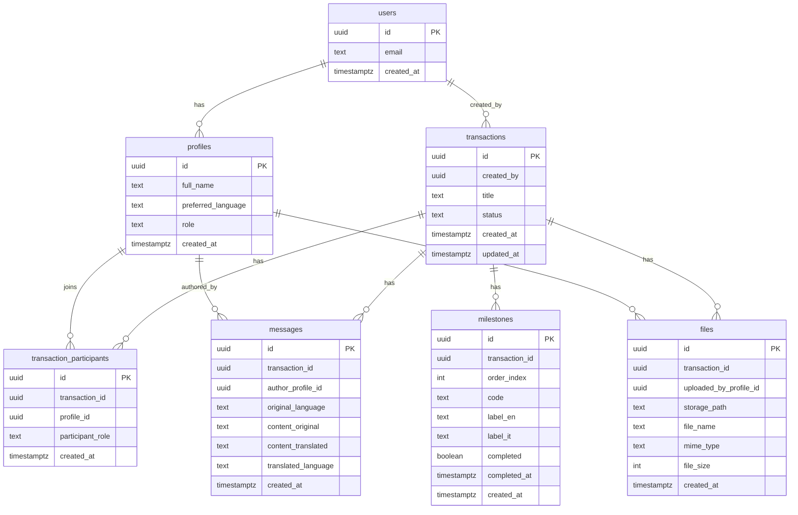

# Supabase Schema (Draft)

This document defines the initial database schema for the MVP, including an ER diagram (Mermaid) and SQL DDL drafts. We keep schemas versioned here and apply via Supabase migrations once approved.

## Entity Relationship Diagram



## SQL DDL (Draft)

Note: Supabase provides `auth.users`. We mirror a row in `public.profiles` on signup.

```sql
-- Enable UUID support if needed
create extension if not exists "uuid-ossp";
```

```sql
create table if not exists public.profiles (
  id uuid primary key references auth.users(id) on delete cascade,
  full_name text,
  preferred_language text not null default 'en',
  role text not null check (role in ('agent','buyer')),
  created_at timestamptz not null default now()
);
```

```sql
create table if not exists public.transactions (
  id uuid primary key default uuid_generate_v4(),
  created_by uuid not null references public.profiles(id) on delete restrict,
  title text not null,
  status text not null default 'active' check (status in ('active','archived','completed')),
  created_at timestamptz not null default now(),
  updated_at timestamptz not null default now()
);
create index if not exists idx_transactions_created_by on public.transactions(created_by);
```

```sql
create table if not exists public.transaction_participants (
  id uuid primary key default uuid_generate_v4(),
  transaction_id uuid not null references public.transactions(id) on delete cascade,
  profile_id uuid not null references public.profiles(id) on delete cascade,
  participant_role text not null check (participant_role in ('agent','buyer')),
  created_at timestamptz not null default now(),
  unique (transaction_id, profile_id)
);
create index if not exists idx_tp_tx on public.transaction_participants(transaction_id);
create index if not exists idx_tp_profile on public.transaction_participants(profile_id);
```

```sql
create table if not exists public.milestones (
  id uuid primary key default uuid_generate_v4(),
  transaction_id uuid not null references public.transactions(id) on delete cascade,
  order_index int not null,
  code text not null,
  label_en text not null,
  label_it text,
  completed boolean not null default false,
  completed_at timestamptz,
  created_at timestamptz not null default now(),
  unique (transaction_id, code)
);
create index if not exists idx_milestones_tx on public.milestones(transaction_id);
```

```sql
create table if not exists public.messages (
  id uuid primary key default uuid_generate_v4(),
  transaction_id uuid not null references public.transactions(id) on delete cascade,
  author_profile_id uuid not null references public.profiles(id) on delete set null,
  original_language text not null,
  content_original text not null,
  content_translated text,
  translated_language text,
  created_at timestamptz not null default now()
);
create index if not exists idx_messages_tx on public.messages(transaction_id);
create index if not exists idx_messages_author on public.messages(author_profile_id);
```

```sql
create table if not exists public.files (
  id uuid primary key default uuid_generate_v4(),
  transaction_id uuid not null references public.transactions(id) on delete cascade,
  uploaded_by_profile_id uuid not null references public.profiles(id) on delete set null,
  storage_path text not null,
  file_name text not null,
  mime_type text,
  file_size int,
  created_at timestamptz not null default now()
);
create index if not exists idx_files_tx on public.files(transaction_id);
create index if not exists idx_files_uploader on public.files(uploaded_by_profile_id);
```

## RLS (Row Level Security) Outline

We will enable RLS on all tables and define policies such that:
- profiles: users can select/update only their own profile.
- transactions: creator can read/write; participants can read; agents can update milestones and invite participants.
- transaction_participants: only involved users can read; agents can insert/remove participants for their transactions.
- milestones: participants can read; agents for the transaction can update.
- messages: participants can read; any participant can insert.
- files: participants can read; participants can upload (insert).

Policies will be added in a subsequent iteration once roles and auth strategy are finalized.

## Seed Milestones (Example)

```sql
-- Example ordered milestones for Italian property purchase
insert into public.milestones (id, transaction_id, order_index, code, label_en, label_it, completed)
values
  (uuid_generate_v4(), :transaction_id, 1, 'OFFER_ACCEPTED', 'Offer Accepted', 'Offerta Accettata', false),
  (uuid_generate_v4(), :transaction_id, 2, 'PRELIM_CONTRACT', 'Preliminary Contract', 'Compromesso', false),
  (uuid_generate_v4(), :transaction_id, 3, 'DEPOSIT_PAID', 'Deposit Paid', 'Caparra Versata', false),
  (uuid_generate_v4(), :transaction_id, 4, 'SURVEY', 'Survey', 'Perizia', false),
  (uuid_generate_v4(), :transaction_id, 5, 'ROGITO', 'Final Deed (Rogito)', 'Rogito', false);
```

## Next Steps
- Confirm ERD and table set.
- Add RLS policy definitions.
- Generate Supabase migrations and apply to project.
- Connect environment variables (`.env.local`) and test from the Next.js app.


