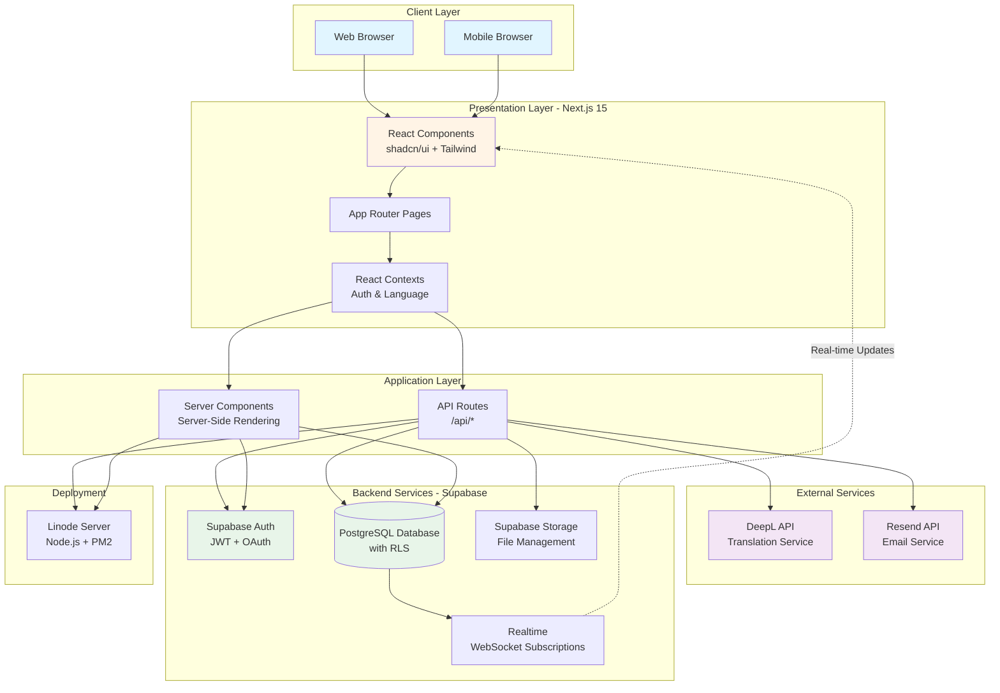

# System Architecture Diagram

## High-Level Architecture Overview

## Technology Stack

### Frontend
- **Framework**: Next.js 15 (App Router)
- **UI Library**: React 19.2.0
- **Styling**: Tailwind CSS v4
- **Components**: shadcn/ui (Radix UI primitives)
- **Language**: TypeScript 5
- **State Management**: React Context API

### Backend
- **Database**: Supabase PostgreSQL
- **Authentication**: Supabase Auth (JWT)
- **Storage**: Supabase Storage (S3-compatible)
- **Real-time**: Supabase Realtime (WebSockets)

### External APIs
- **Translation**: DeepL API
- **Email**: Resend API with React Email templates

### Infrastructure
- **Hosting**: Linode VPS
- **Process Manager**: PM2
- **Runtime**: Node.js 18+

## Key Architecture Patterns

### 1. Server-Side Rendering (SSR)
- Pages are rendered on the server for optimal performance
- Initial page load includes fully rendered HTML
- Client-side hydration for interactivity

### 2. API Routes
- RESTful API endpoints for complex operations
- Server-side validation and business logic
- Secure access to external services (DeepL, Resend)

### 3. Row Level Security (RLS)
- Database-level access control
- Users can only access their own data
- Transaction participants have scoped access

### 4. Real-time Subscriptions
- WebSocket connections for live updates
- Messages appear instantly
- Milestone completion notifications

### 5. Multi-tenancy
- Agent-level isolation
- Buyers associated with specific agents
- Transaction-based access control

## Security Features

1. **Authentication**: JWT tokens with secure cookie storage
2. **Authorization**: Row Level Security policies on all tables
3. **Data Validation**: Server-side validation on all API routes
4. **HTTPS**: Encrypted connections for all traffic
5. **Environment Variables**: Sensitive credentials stored securely
6. **CORS**: Configured for specific origins only

## Performance Optimizations

1. **Translation Caching**: JSONB storage for translated messages
2. **Database Indexes**: Optimized queries on foreign keys
3. **Server Components**: Reduced client-side JavaScript
4. **Image Optimization**: Next.js Image component
5. **Code Splitting**: Automatic by Next.js App Router

## Scalability Considerations

1. **Horizontal Scaling**: Stateless API routes
2. **Database Connection Pooling**: Supabase handles connections
3. **CDN**: Static assets served via CDN
4. **Caching**: Translation cache reduces API calls
5. **Background Jobs**: Email sending via Resend queue
