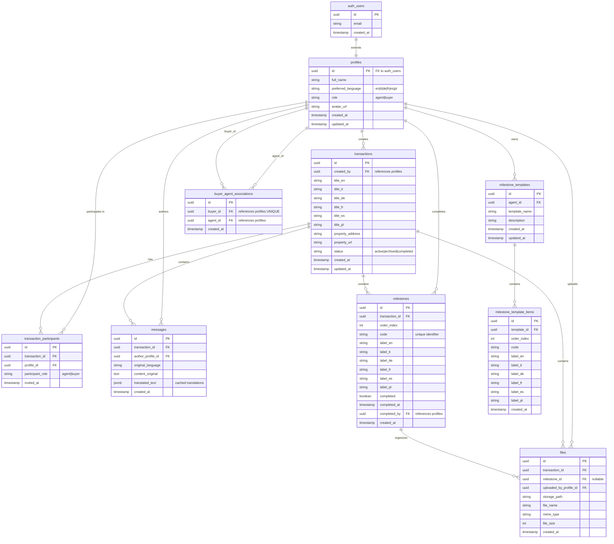

# Database Schema Diagram

## Entity Relationship Diagram



## Table Descriptions

### Core Tables

#### 1. profiles
**Purpose**: User profiles extending Supabase auth.users
- Stores user metadata (name, language, role, avatar)
- One-to-one relationship with auth.users
- Role-based access (agent or buyer)

**RLS Policies**:
- Users can view their own profile
- Users can update their own profile
- Agents can view profiles of their buyers

#### 2. transactions
**Purpose**: Property transaction records
- Created by agents
- Multi-language support for titles (6 languages)
- Tracks property details and status
- Soft delete with archive status

**RLS Policies**:
- Transaction participants can view
- Only creator (agent) can update/delete
- Buyers can view transactions they're invited to

#### 3. transaction_participants
**Purpose**: Many-to-many relationship between users and transactions
- Links users to transactions they can access
- Stores role within transaction (agent/buyer)
- Invitation timestamp tracking

**RLS Policies**:
- Participants can view their own participation
- Transaction creator can add/remove participants

#### 4. milestones
**Purpose**: Transaction progress tracking stages
- Ordered list of steps in transaction process
- Multi-language labels (6 languages)
- Completion tracking with timestamp and user
- Customizable per transaction

**RLS Policies**:
- Transaction participants can view
- Participants can mark as complete
- Only creator can add/edit/reorder/delete

#### 5. messages
**Purpose**: Communication between transaction participants
- Original language preservation
- Auto-translation caching in JSONB
- Real-time updates via Supabase subscriptions

**RLS Policies**:
- Transaction participants can view all messages
- Any participant can send messages
- Cannot edit or delete messages (audit trail)

#### 6. files
**Purpose**: Document storage metadata
- Links to Supabase Storage
- Optional milestone association
- Tracks uploader and file details

**RLS Policies**:
- Transaction participants can view/upload
- Only uploader or creator can delete
- Storage bucket has matching policies

### Association Tables

#### 7. buyer_agent_associations
**Purpose**: One-to-many relationship (buyer belongs to one agent)
- Buyer can only have one agent
- Agent can have multiple buyers
- Used for buyer management and invitations

**RLS Policies**:
- Agents can view their buyers
- Buyers can view their agent

### Template System

#### 8. milestone_templates
**Purpose**: Reusable milestone templates per agent
- Agent-specific templates
- Named templates for different transaction types
- Versioning via timestamps

**RLS Policies**:
- Agent can view/create/edit/delete their templates

#### 9. milestone_template_items
**Purpose**: Individual milestones within a template
- Ordered list of milestone definitions
- Multi-language labels
- Applied to new transactions

**RLS Policies**:
- Agent (template owner) can view/edit

## Database Features

### 1. Row Level Security (RLS)
All tables have RLS enabled with specific policies for:
- SELECT: Who can read data
- INSERT: Who can create records
- UPDATE: Who can modify records
- DELETE: Who can remove records

### 2. Triggers
- **on_auth_user_created**: Auto-creates profile when user signs up
- **on_transaction_created**: Auto-adds creator as participant

### 3. Functions (RPC)
- `create_default_milestones(transaction_id)`: Creates 5 default milestones
- `get_agent_buyers(agent_id)`: Returns agent's buyers
- `delete_transaction(transaction_id)`: Cascading delete with cleanup

### 4. Indexes
Optimized for common queries:
- Foreign keys (transaction_id, profile_id, etc.)
- Status fields (transaction.status)
- Completion flags (milestone.completed)
- Timestamps (created_at for sorting)

### 5. Constraints
- **UNIQUE**:
  - (transaction_id, profile_id) in transaction_participants
  - (transaction_id, code) in milestones
  - (agent_id, template_name) in milestone_templates
  - buyer_id in buyer_agent_associations
- **NOT NULL**: Required fields enforced at DB level
- **CHECK**: Status enums, role enums validated

## Data Types

### UUID
All primary keys and foreign keys use UUID v4 for:
- Security (non-sequential)
- Distributed systems support
- URL-safe identifiers

### JSONB
Used for translation caching:
```json
{
  "en": "Mortgage approval",
  "it": "Approvazione del mutuo",
  "de": "Hypothekengenehmigung",
  "fr": "Approbation d'hypothèque",
  "es": "Aprobación de hipoteca",
  "pl": "Zatwierdzenie kredytu hipotecznego"
}
```

Benefits:
- Fast lookups with indexing
- Flexible schema for languages
- Reduces API calls to DeepL

### Timestamp with Timezone
All timestamps use `timestamptz` for:
- Universal time coordination
- Automatic timezone conversion
- Accurate sorting across regions

## Storage Integration

### Supabase Storage Buckets

**transaction-files** bucket:
- Path structure: `{transaction_id}/{file_id}_{filename}`
- Public read for participants
- Authenticated upload
- RLS policies match database policies

## Migration Strategy

31 migrations applied sequentially:
1. Initial schema creation
2. Add RLS policies
3. Add triggers and functions
4. Add multi-language support
5. Add template system
6. Bug fixes and optimizations
7. Index additions for performance

All migrations are reversible and tracked in Supabase.
