# Data Flow Diagrams

## 1. User Authentication Flow

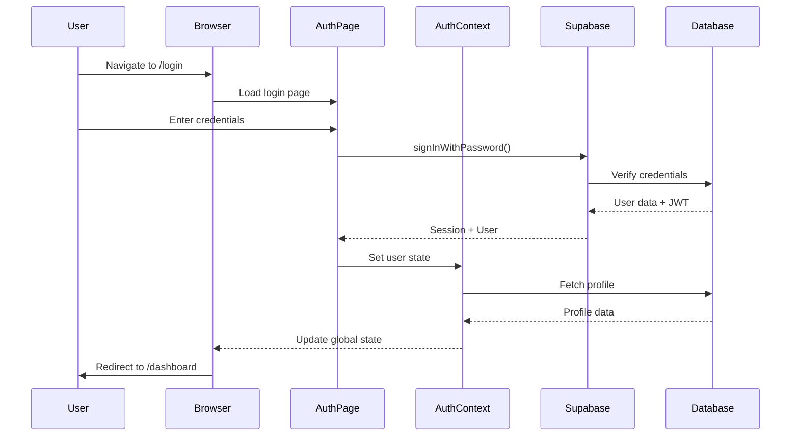

## 2. Transaction Creation Flow

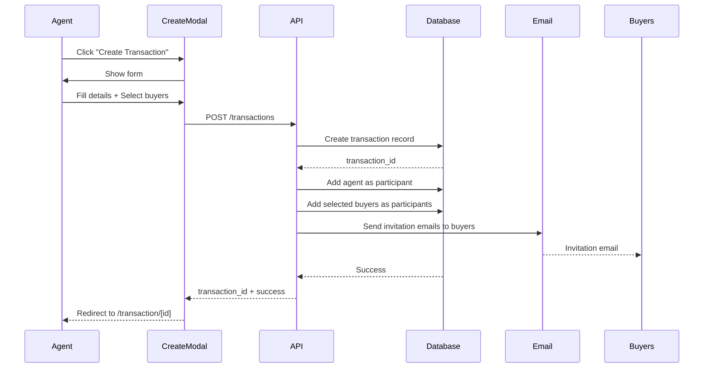

## 3. Real-time Messaging Flow

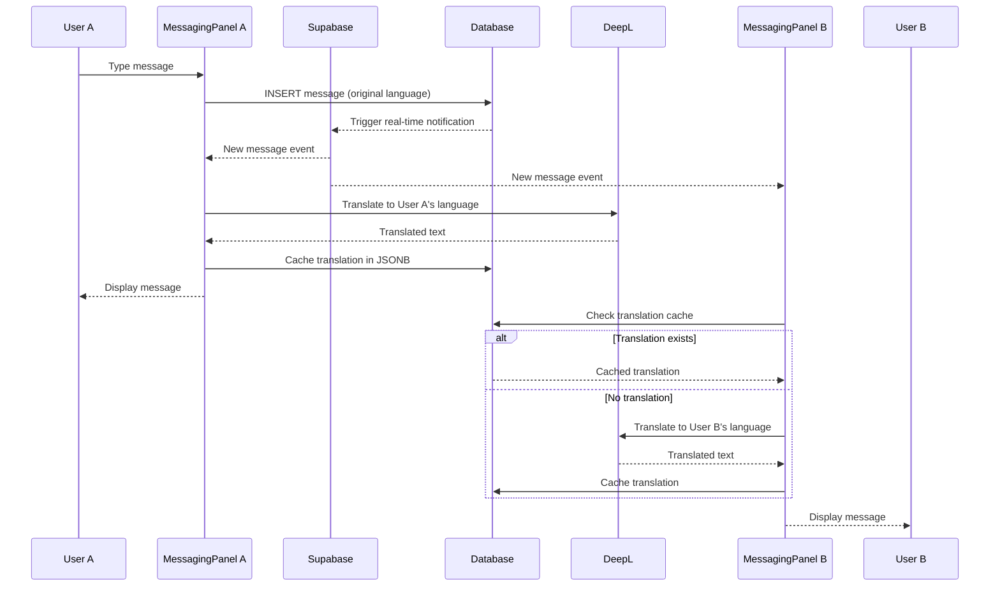

## 4. Milestone Completion Flow

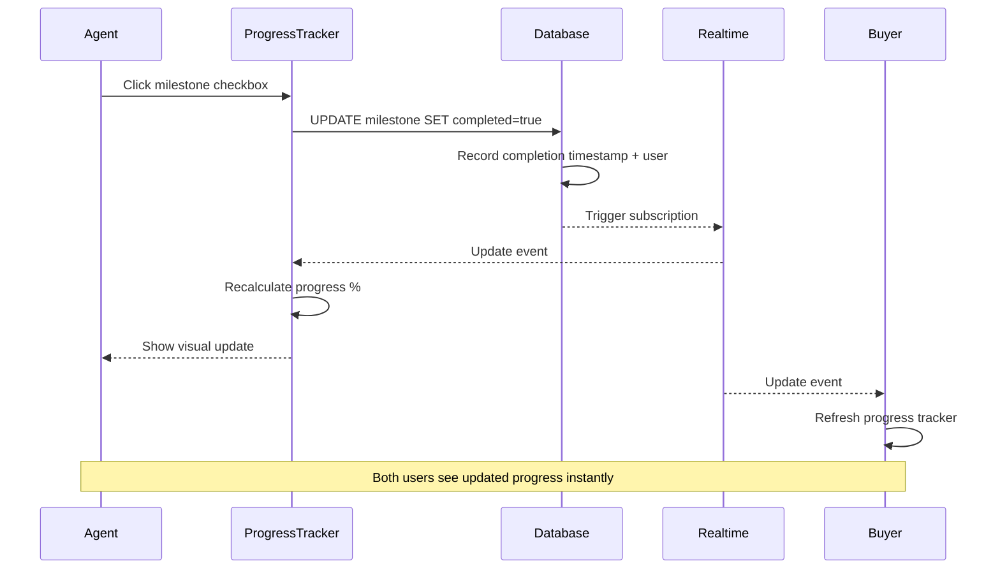

## 5. File Upload Flow

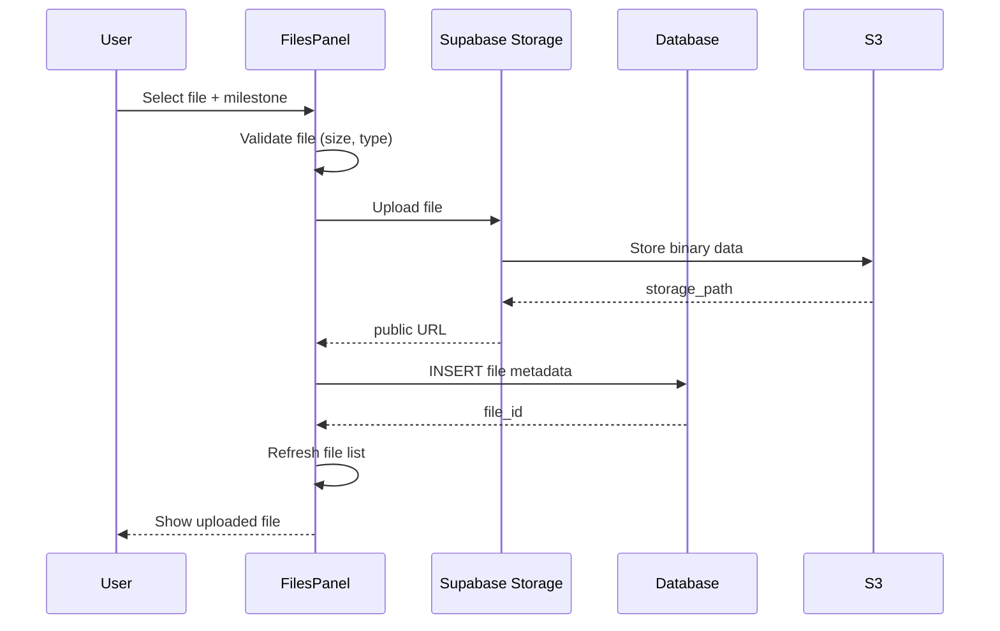

## 6. Translation Caching Strategy

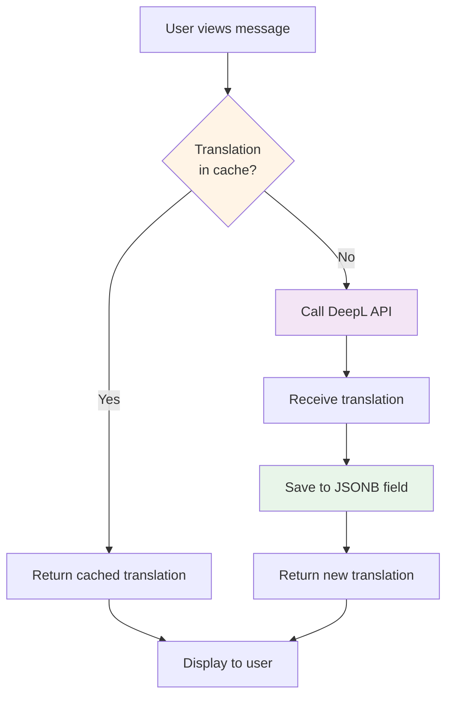

## 7. Row Level Security (RLS) Flow

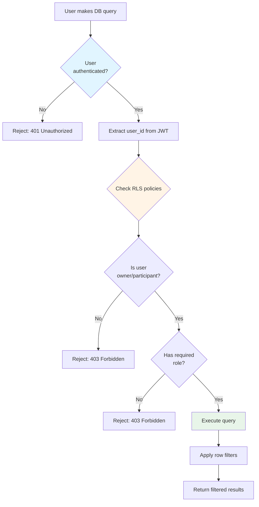

## 8. Email Progress Summary Flow

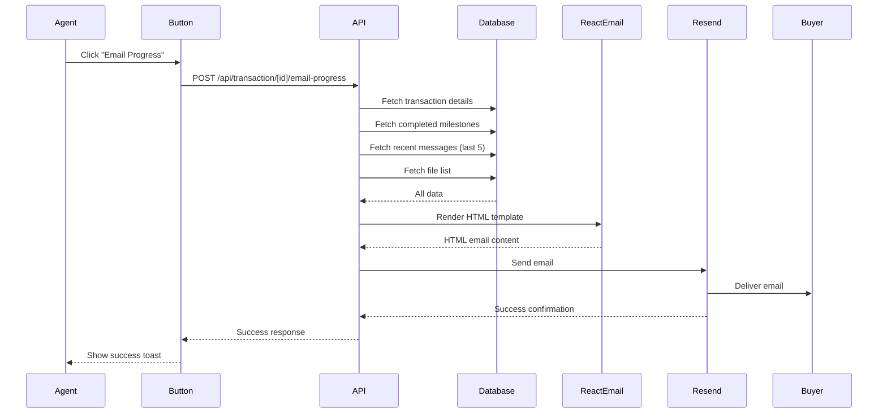

## 9. Buyer Invitation Flow

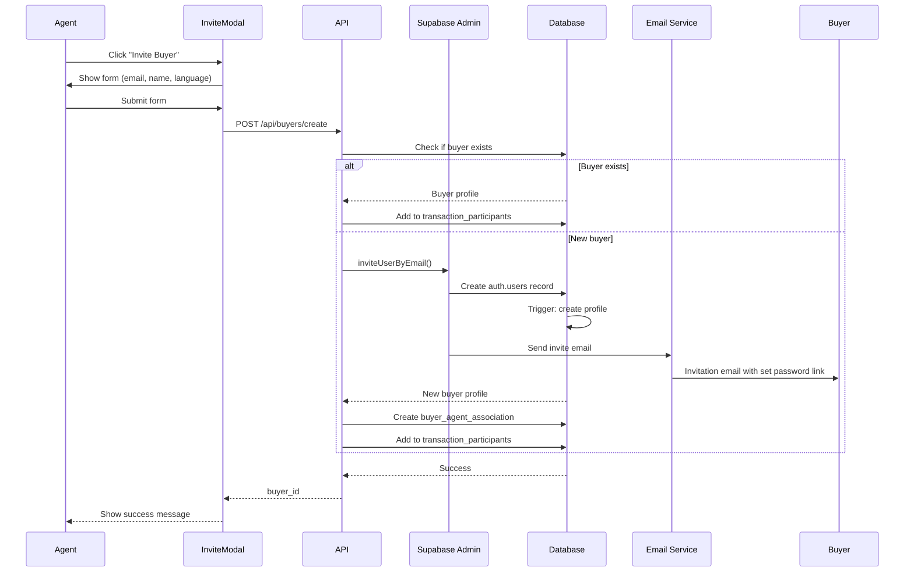

## 10. Transaction Deletion Flow

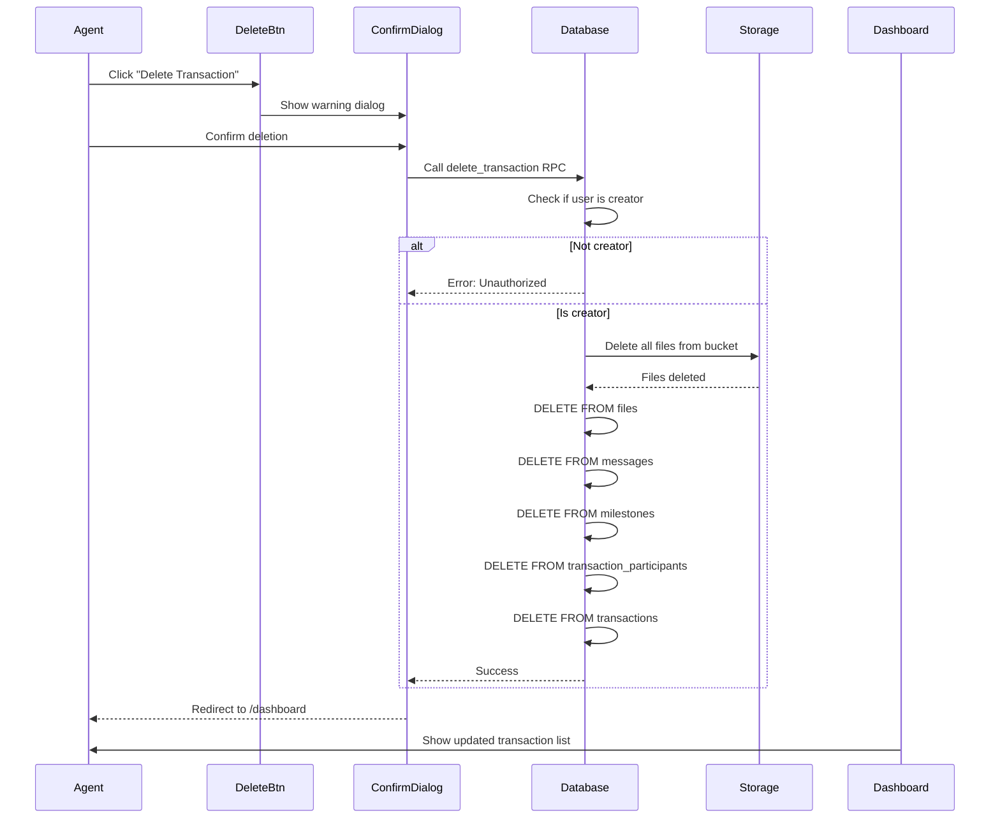

## 11. Language Switching Flow

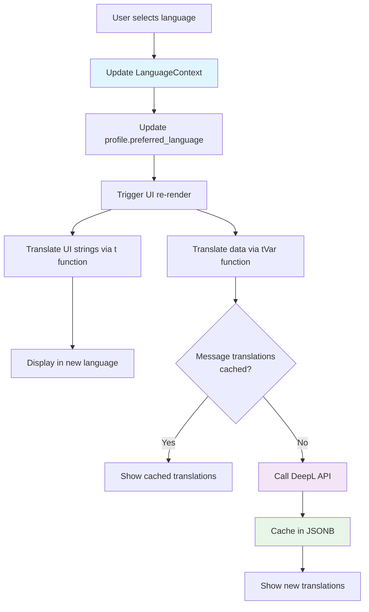

## 12. Milestone Template Application Flow

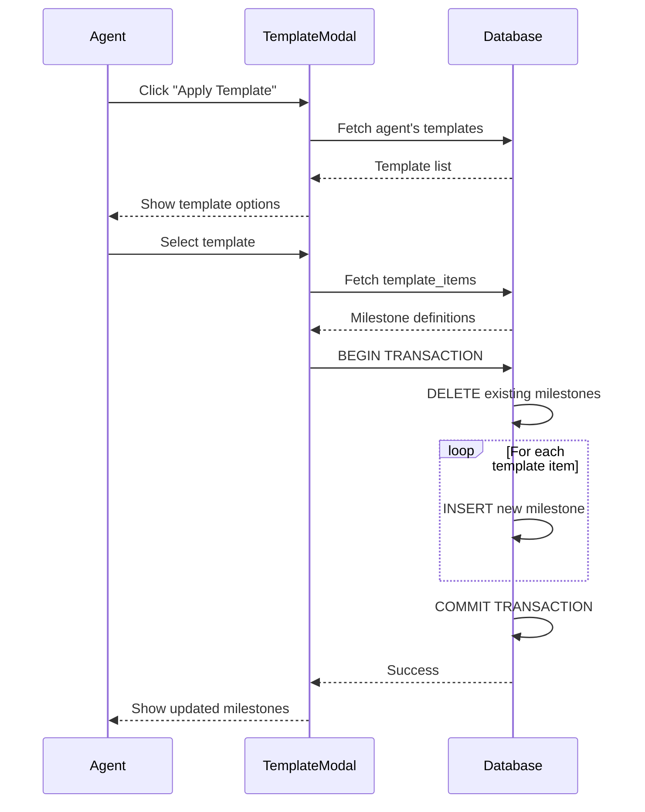

## Data Flow Patterns

### 1. Optimistic Updates
Some UI updates happen immediately before server confirmation:
- Milestone toggle (reverted on error)
- Message sending (shows "sending" state)

### 2. Real-time Synchronization
WebSocket subscriptions keep data synchronized:
- New messages appear instantly
- Milestone completions broadcast to all users
- File uploads notify participants

### 3. Caching Strategy
Multiple levels of caching:
- **Translation cache**: JSONB in database
- **Browser cache**: React state
- **HTTP cache**: Next.js server components

### 4. Error Handling
All flows include error handling:
- API errors show toast notifications
- Network failures trigger retries
- Invalid data rejected at multiple levels (client, API, database)

### 5. Security Checkpoints
Every data flow includes security checks:
- JWT authentication
- RLS policies at database level
- API route authorization
- Client-side permission checks (UI only)

## Performance Considerations

### 1. Batching
- Multiple translations batched in single API call
- Database queries use joins to reduce round trips

### 2. Pagination
- Message lists paginated (50 per page)
- Transaction lists paginated (20 per page)
- File lists limited to recent uploads

### 3. Lazy Loading
- Modal components loaded on demand
- Images lazy loaded below the fold
- File previews generated on request

### 4. Debouncing
- Search inputs debounced (300ms)
- Auto-save debounced (500ms)
- Translation requests debounced (200ms)
