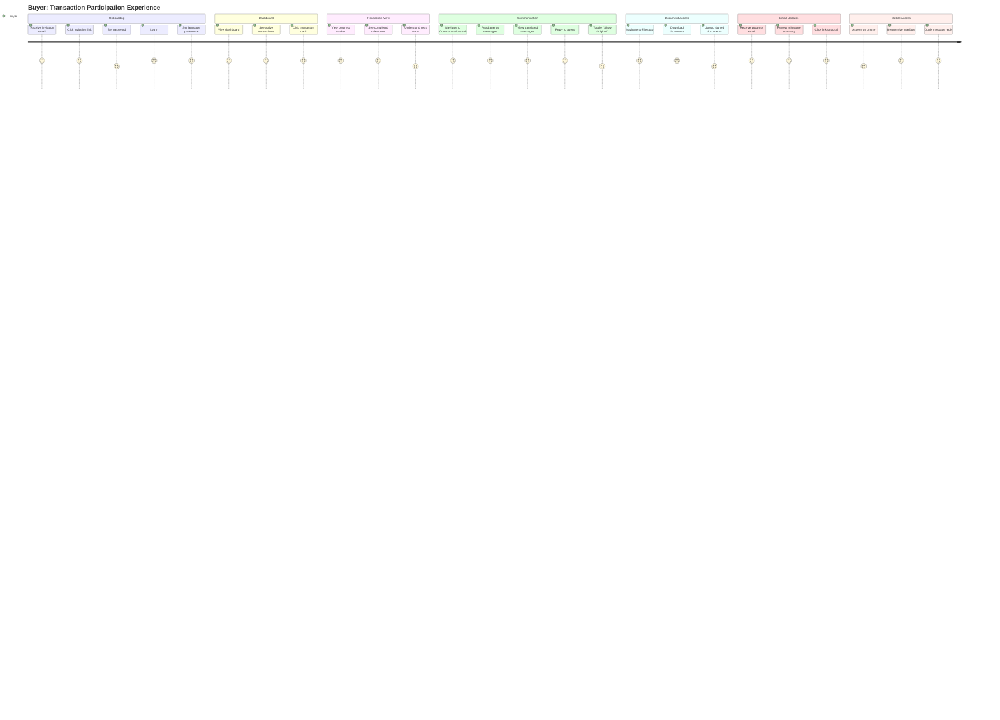
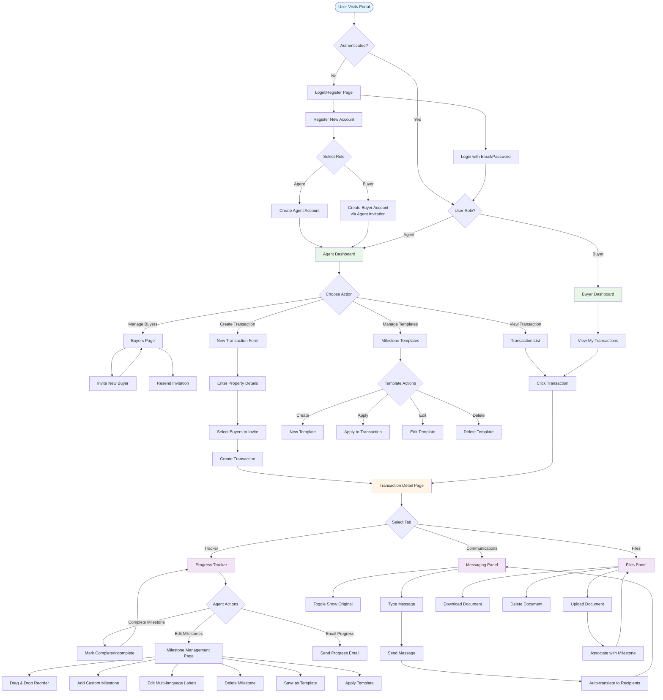
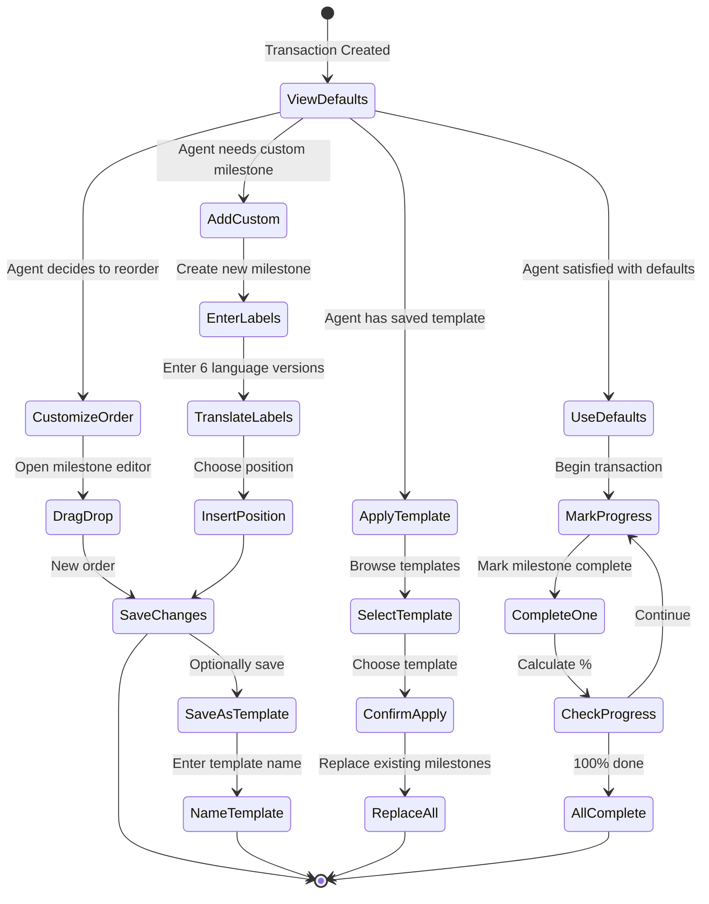
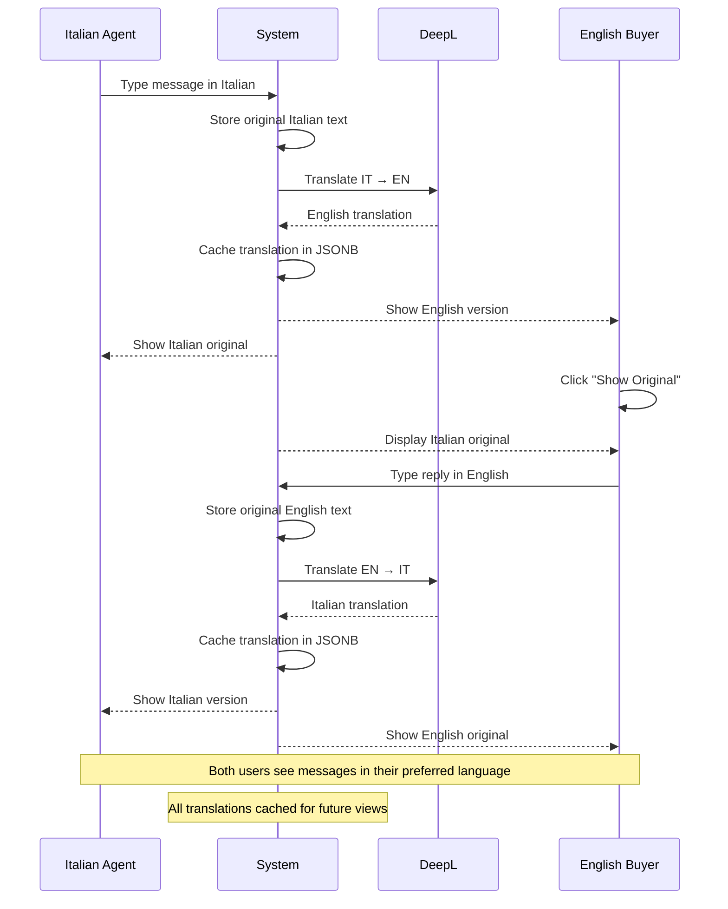
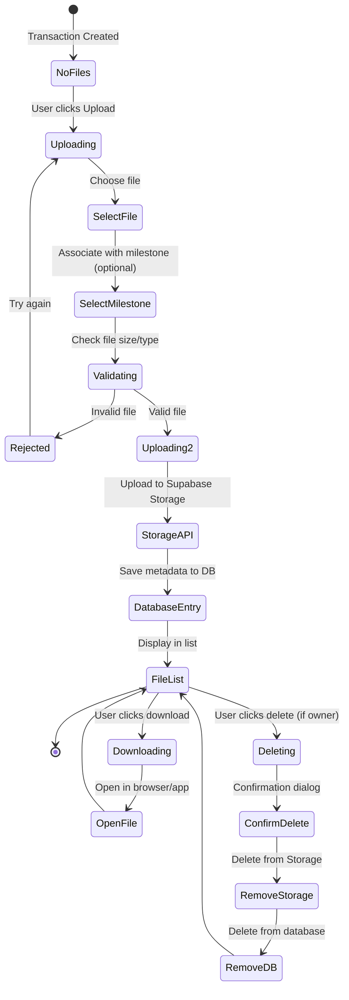
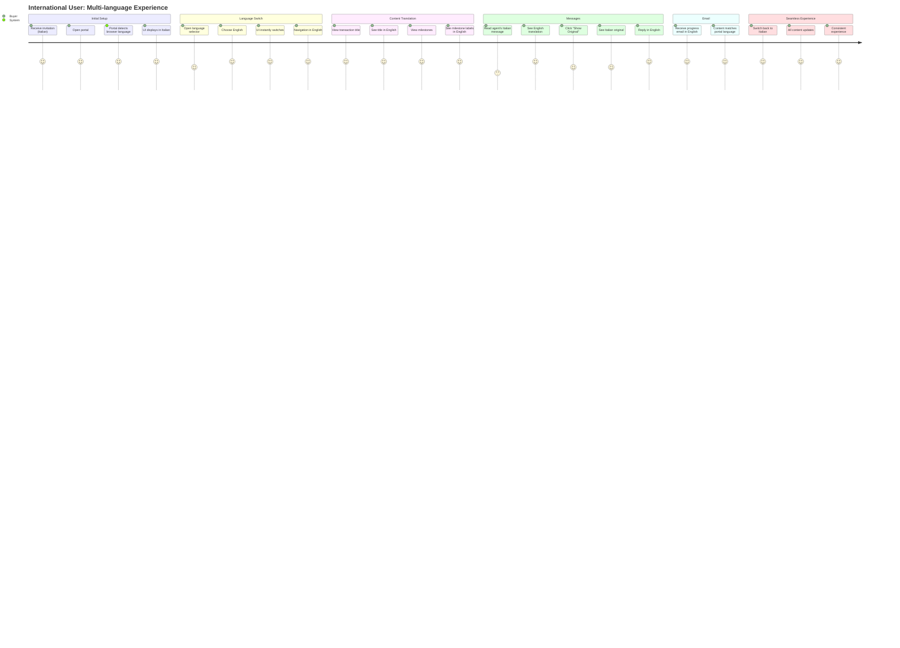

# User Journey Diagrams

## 1. Agent Journey: Creating and Managing a Transaction


## 2. Buyer Journey: Participating in a Transaction



## 3. Complete User Flow Diagram



## 4. Milestone Management Journey



## 5. Communication Journey with Translation



## 6. File Management Journey



## 7. Error Handling Journey

```mermaid
flowchart TD
    Action[User Performs Action] --> Validate{Valid Input?}

    Validate -->|No| ClientError[Show Client-side Error]
    ClientError --> Retry[User Corrects Input]
    Retry --> Action

    Validate -->|Yes| SendRequest[Send to Server]
    SendRequest --> ServerCheck{Server Validation}

    ServerCheck -->|Fail| ServerError[Show Error Toast]
    ServerError --> Retry

    ServerCheck -->|Pass| DBCheck{Database Operation}

    DBCheck -->|Error| DBError[Database Error]
    DBError --> RLSCheck{RLS Policy?}
    RLSCheck -->|Yes| Unauthorized[Show 403 Error]
    RLSCheck -->|No| GenericError[Show Generic Error]

    Unauthorized --> ContactSupport[Contact Admin]
    GenericError --> Retry

    DBCheck -->|Success| Success[Show Success Message]
    Success --> UpdateUI[Update UI]
    UpdateUI --> [*]

    style ClientError fill:#ffebee
    style ServerError fill:#ffebee
    style DBError fill:#ffebee
    style Success fill:#e8f5e9
```

## 8. Multi-language Experience Journey



## User Pain Points Addressed

### 1. Language Barriers
**Problem**: International property transactions involve parties speaking different languages
**Solution**:
- 6 language support (EN, IT, PL, ES, FR, DE)
- Auto-translation of messages via DeepL
- Multi-language milestone labels
- User-specific language preferences
- "Show Original" option to verify translations

### 2. Progress Tracking
**Problem**: Buyers don't know transaction status
**Solution**:
- Visual progress tracker with completion percentage
- Real-time milestone updates
- Email progress summaries
- Mobile-responsive design for on-the-go checking

### 3. Document Management
**Problem**: Files scattered across email, WhatsApp, etc.
**Solution**:
- Centralized file storage
- Milestone-based organization
- Easy upload/download
- Access control per transaction

### 4. Communication Silos
**Problem**: Messages lost in email threads
**Solution**:
- Dedicated messaging panel per transaction
- Chronological message history
- Real-time updates
- Searchable message archive

### 5. Template Reusability
**Problem**: Agents recreate milestones for every transaction
**Solution**:
- Milestone template system
- Save custom workflows
- Apply templates to new transactions
- Share templates (future feature)

## User Segments and Their Needs

### Real Estate Agents
**Primary Goals**:
- Manage multiple transactions simultaneously
- Track progress efficiently
- Communicate with international buyers
- Maintain professional image

**Key Features Used**:
- Dashboard overview
- Transaction creation
- Milestone management
- Buyer invitation
- Progress emails

### International Buyers
**Primary Goals**:
- Understand transaction status
- Communicate in native language
- Access documents anytime
- Know next steps

**Key Features Used**:
- Progress tracker
- Message translation
- File downloads
- Email notifications

### Bilingual Coordinators
**Primary Goals**:
- Bridge language gaps
- Ensure clarity
- Maintain audit trail
- Coordinate multiple parties

**Key Features Used**:
- "Show Original" toggle
- Translation cache
- Message history
- Multi-language UI

## Accessibility Considerations

1. **Keyboard Navigation**: All interactive elements accessible via keyboard
2. **Screen Readers**: Semantic HTML with ARIA labels
3. **Color Contrast**: WCAG AA compliance
4. **Font Sizes**: Responsive typography
5. **Mobile Touch Targets**: 44x44px minimum

## Future Journey Enhancements

### Phase 2 Features
- **Push Notifications**: Real-time mobile alerts
- **Document Signing**: E-signature integration
- **Calendar Integration**: Appointment scheduling
- **Activity Feed**: Detailed audit log
- **Analytics Dashboard**: Transaction insights

### Phase 3 Features
- **Video Calls**: In-app video conferencing
- **AI Assistance**: Smart milestone suggestions
- **Automated Reminders**: Email reminders for pending actions
- **Mobile Apps**: Native iOS/Android apps
- **Advanced Search**: Full-text search across all transactions
